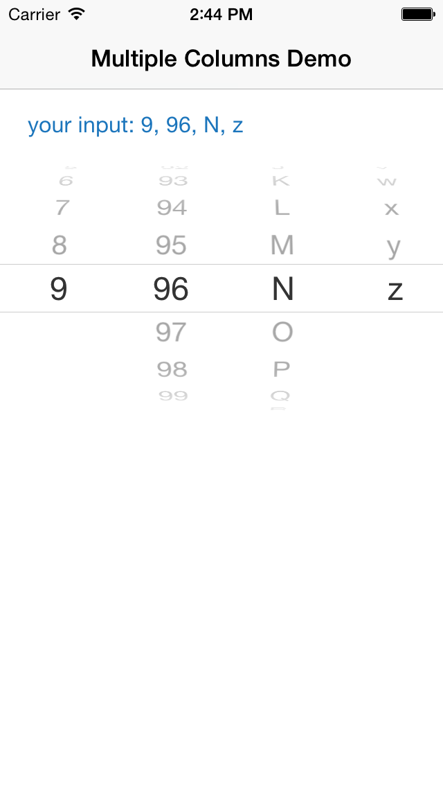

multi-picker-demo
=================

a demo about Multiple Columns UIPickerView in RubyMotion

reference: [iOS Programming Recipe 9: Adding Multiple Columns to UIPickerView](http://nscookbook.com/2013/01/ios-programming-recipe-9-adding-multiple-columns-to-uipickerview/)

